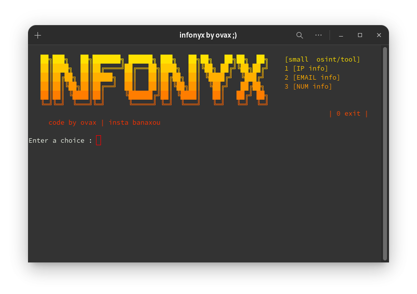
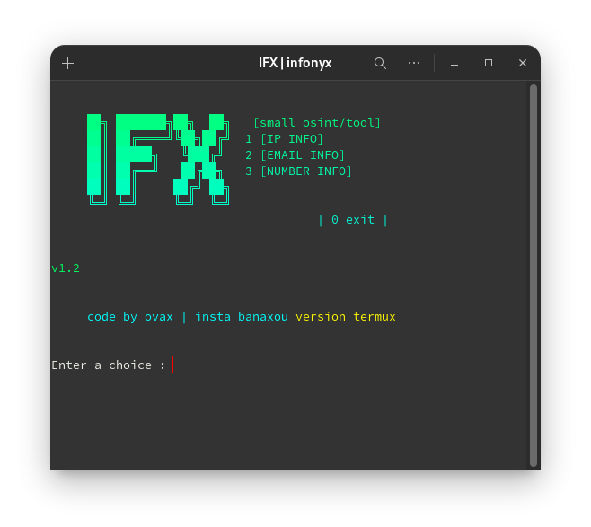

# 🔎 Infonyx - OSINT Tool 
# 💻windows/linux version 1.2

## 🐧 linux
```bash 
git clone https://github.com/banaxou/infonyx
cd infonyx
bash linux.sh
```
## 🪟 windows
```bash
git clone https://github.com/banaxou/infonyx
cd infonyx
start windows.bat
```
# 📱termux/mobile version 1.3 


## 📱termux 
```bash
git clone https://github.com/banaxou/infonyx
cd infonyx
bash termux.sh
```
##  🟠 start 
```python
python infonyx.py
```
## 🖥️ install python
- 🐍 **https://www.python.org/downloads/**


---
## ⚙️ Features

- 🔍 Retrieve information about phone numbers
- 🌐 Collect IP information, including identifying open ports
- 🛠️ Search for email details and use the Holehe tool
- [holehe](https://github.com/megadose/holehe)
- [ignorant](https://github.com/megadose/ignorant)

## 🌸 Contribute

**Issues and PRs are welcome !**  
Want to suggest an improvement or help with code? Open an issue or pull request 
## 💬​ **Join r/veloxia | The OSINT & Dev Community**  
[r/veloxia](https://www.reddit.com/r/veloxia/)

---
## ❤️ Donate

Your support helps keep this tool alive and open source!

<h1>Ethereum</h1>
  

[0x4cc818bc2C4291CEa8117D9F8D8417EE054fEA58](https://etherscan.io/address/0x4cc818bc2C4291CEa8117D9F8D8417EE054fEA58)

---
‎<h1>sol</h1>


[BVMkqwkMjtTNmD5spKayhYeb6JUfmReGxGaD4kcetXp2](https://solscan.io/account/BVMkqwkMjtTNmD5spKayhYeb6JUfmReGxGaD4kcetXp2)

> **infonyx 1.2**
---


 
 
[bc1pch0t574x0xpr6vad5ru0862kyw9le8qv2ja3ufdpnhz4hfcp54ksn2guqy](https://blockchair.com/bitcoin/address/bc1pch0t574x0xpr6vad5ru0862kyw9le8qv2ja3ufdpnhz4hfcp54ksn2guqy)
